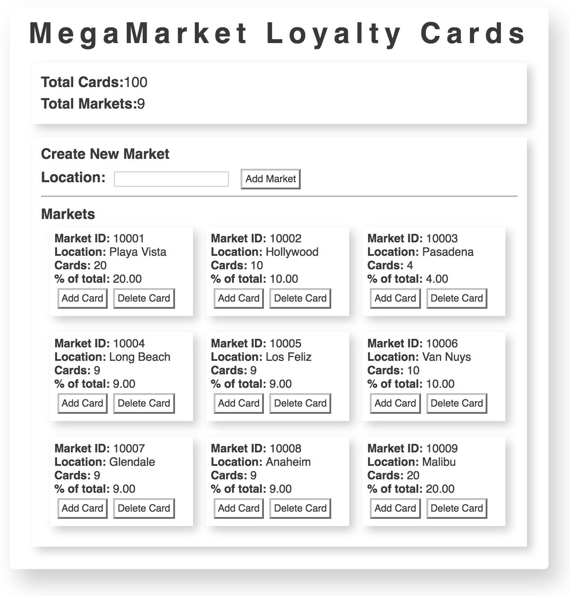

# unit-7-react-redux

React and Redux

## Redux


[Redux](http://redux.js.org/) is a predictable state container to help manage application state.
It modifies the [Flux architecture](https://facebook.github.io/flux/) introduced by Facebook to further enforce unidirectional data flow.
Although Redux can be used without React, it is often used in conjunction with [React-Redux](https://github.com/reactjs/react-redux) to build scalable web applications.

Redux itself is a relatively lightweight library (it adds 2kB to your application), with a few new APIs to learn.
Its power lies behind how it used to to make your code easy to reason about, run consistently, and simple to test.
This is done through Redux's three fundamental principles:

- A **single source of truth** contained in a store.
- **State is read-only**. The only way to change state is though emitting an action.
- **Changes are made with pure functions** in the form of reducers.

### Store

The Redux store is the "single source of truth", meaning that the store holds all of the application state in one place. All components get their state from the store.

Stores are typically structured as deeply nested objects.

The store cannot be updated directly, instead it is updated through actions and reducers.

### Actions

Actions describe events that have taken place in an application and an intent to change state. They simply notify the store that some event has occurred and pass along any data relating to that event.

Actions are structured as objects with key-value pairs. The only required key is "type". The type property has a string value that describes the event in plain English. Since these actions will be used throughout the app, each action type should be unique.

As an example, if someone added a name to a (hypothetical) list, we would want to emit/dispatch an action describing that event and pass along the added name:

```js
// Action object for adding a name to a list
{ type: 'NAME_ADDED', name: 'Erlich Bachman' }
```

Creating these action objects throughout an application can get tedious and decentralized. Our code would be much more organized and easier to update if we could put action objects in one file and just import them into the component where the action would be occurring. This is where action creators can be helpful.

Action creators are functions that return action objects. Instead of writing an action as an object literal, we can instead create a function that will return the action object.

```js
// Add name action creator
function addName(name) {
  return {
    type: "NAME_ADDED",
    name, // This is just ES6 shorthand for name: name
  };
}
```

Now we need a way to let our store know that this action has occurred. Redux includes a "dispatch" method that broadcasts actions to the store. Dispatch takes in an action object and emits that action to the application.

Notice that actions and action creators have no physical effect on state. The dispatched action only **describes** an intent to change state.

### Reducers

Reducers are the mechanism for updating state. They are pure functions that essentially wait for dispatched actions and update state accordingly. **Reducers must always return state** - even if state was unmodified.

Reducers take two parameters: the previous state and the dispatched action. These parameters should **never be mutated**. So state should essentially be copied, updated (if necessary) and then returned. Libraries like [immutable.js](https://facebook.github.io/immutable-js/) are often used alongside Redux so that objects are not mutated inadvertently.

When an action is dispatched, it is passed to **every** reducer. If that action is something the reducer is interested in, it can perform some logic and return the updated state. Continuing our 'name added' example, once the name added action has been dispatched, the reducer function would take in the app's state and name added action as parameters. Then it would update state (adding the name to a list of names) based on the action being passed in.

```js
function listReducer(state, action) {
  switch (action.type) {
    case "NAME_ADDED":
      const names = [].concat(state.nameList); // creating a new array
      names.push(action.name);
      return Object.assign({}, { nameList: names }); //returning a new state object
  }
}
```

Each reducer is called once when the store is being created. Therefore, reducers are where you set the app's initial state.

Given that reducers are pure functions, there are 3 things reducers **never** do:

1. Mutate its arguments
2. Perform side effects (like API calls)
3. Call non-pure functions (Date.now(), Math.random(), etc)

For more information on reducers, refer to the Redux docs:

- A general overview of how to construct a reducer: http://redux.js.org/docs/basics/Reducers.html
- For more complex applications, an app might need more than one reducer, responsible for different pieces of state. This is where CombineReducers comes in handy: http://redux.js.org/docs/api/combineReducers.html

## Getting Started

### Setup

- [ ] Go to the Chrome Web Store and download/install Redux DevTools
- [ ] Run `npm install` to install all the dependencies.
- [ ] Run `npm start` to start your Webpack Development Server, and navigate to `http://localhost:8080`.
- [ ] Whoa, you find that the page is blank! Use those debugging skills to figure out why and how to first get **MegaMarket Loyalty Cards** rendering on your screen. From there, work your way through the files to get more components rendered.

### Challenges

For this unit, we'll be creating a loyalty card tracker for a supermarket chain. The user of our application should be able to create new markets and add or delete loyalty cards from each them. We'll want to be able to track the total number of markets, total number of cards, and distribution metrics of cards across all the markets.

The application should have the following hierarchical structure:

```
|-- App
  |-- MainContainer
      |-- TotalsDisplay
      |-- MarketsContainer
          |-- MarketCreator
          |—- MarketsDisplay
              |—- Market
```

The end goal is to get your app looking something like this...



And it should have the following functionality:

1. If you enter a location name and click _"Add Market"_, you should see a new Market card and the Total Markets value should increment by one. Add at least six of these.

2. If you click on _"Add Card"_ on a given Market card, you should see the Cards and % of total update. You should also see Total Cards increment by one.

3. If you click on _"Delete"_ Card on a given Market card, you should see the Cards and % of total update. You should also see _"Total Cards"_ decrement by one.

4. Inspect your page and go to the Redux tab. Watch the state updates in the Devtools as you add and remove cards.

### Extensions

1. Use Immutable.js to ensure that state never gets mutated.

2. Store market and loyalty card data in a database of your choice and fetch them onload.

3. Refactor your Node-React calendar to use React-Redux
